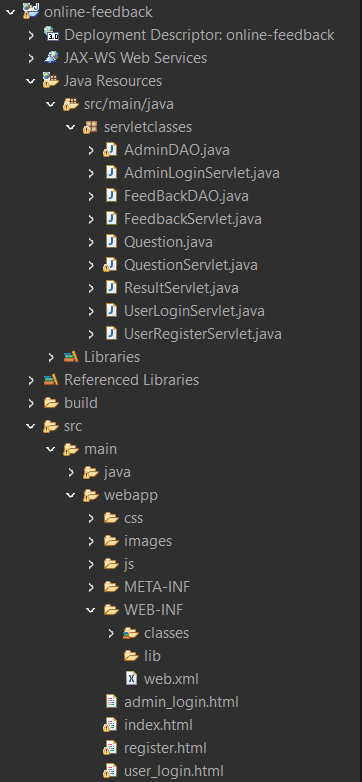
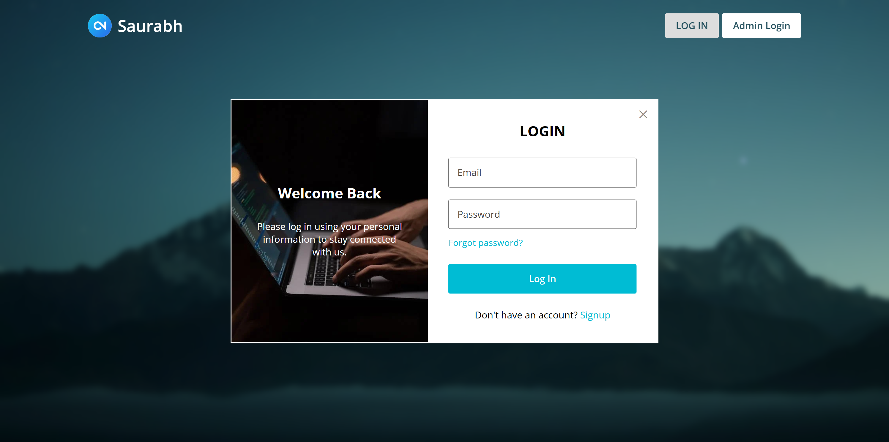
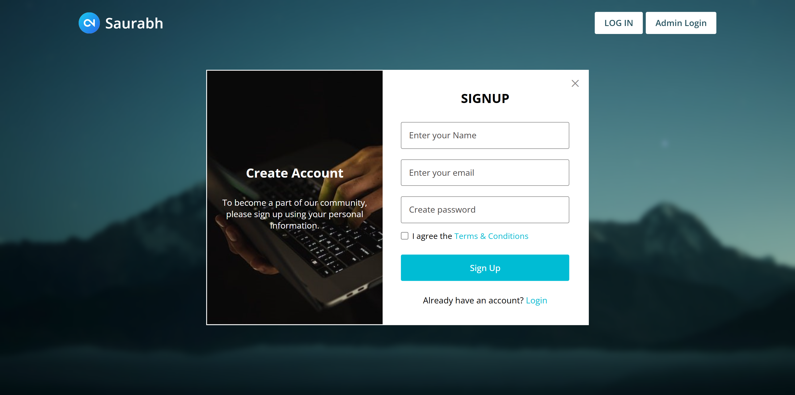
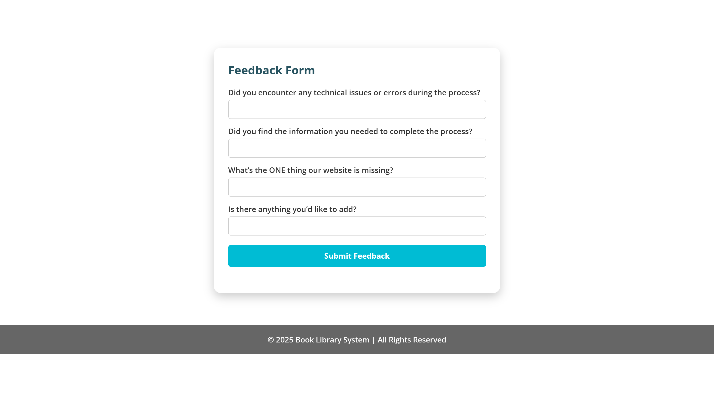
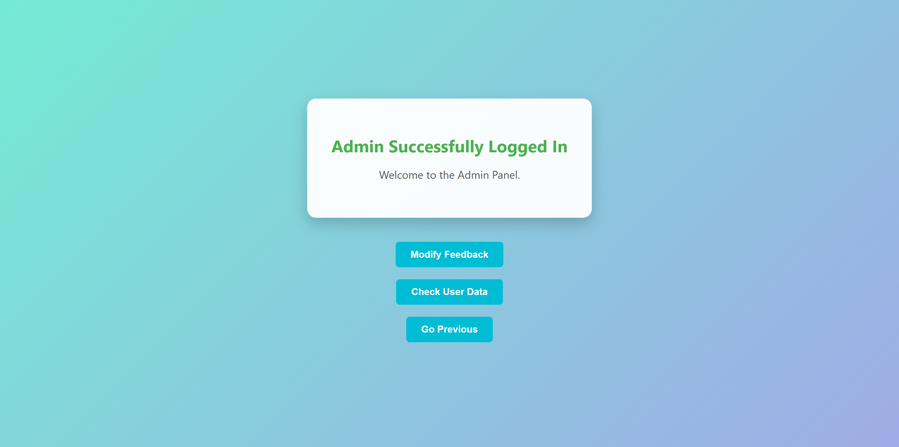
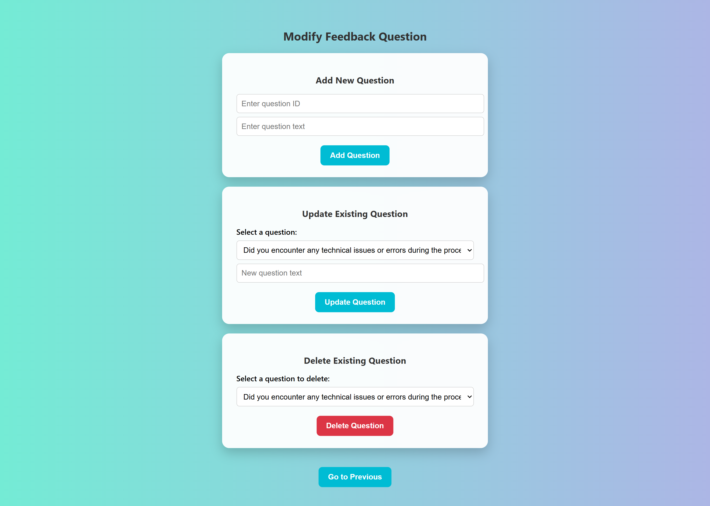
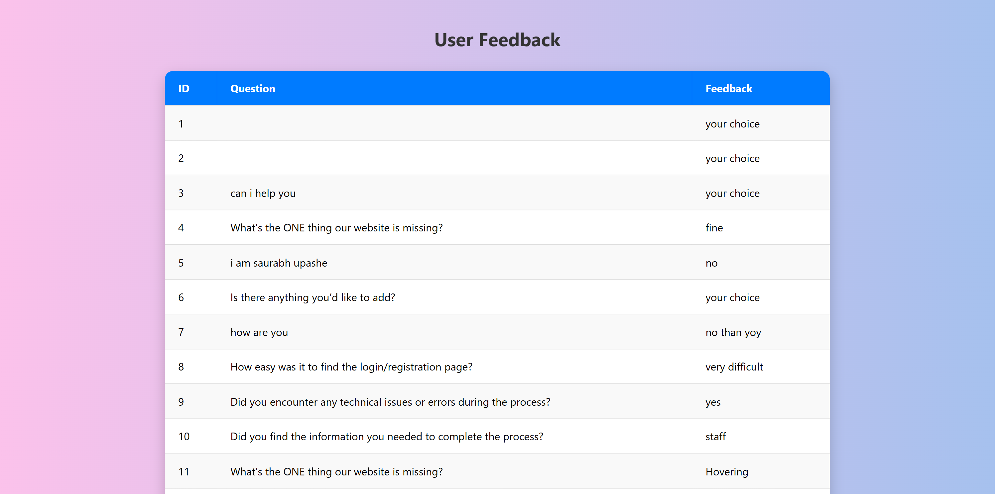

# 📝Online_Feedback_System_Management

A simple and efficient web-based feedback management system built using **Java Servlet**, **JDBC**, and **MySQL** (without JSP). This project allows administrators to manage feedback questions and view responses, while users can log in and submit feedback through a structured form.

---

## 📌 Table of Contents

- [Project Description](#project-description)
- [Technologies Used](#technologies-used)
- [Features](#features)
- [Folder Structure](#folder-structure)
- [Screenshots](#screenshots)
---

## 📖 Project Description

The **Online Feedback System** is designed to digitize the process of collecting and managing feedback in an organization (e.g., schools, universities, businesses). It consists of two main roles:

- **Admin**: Can manage feedback questions and view submitted feedback.
- **User**: Can log in and submit feedback for available questions.

---

## 🛠️ Technologies Used

- **Java Servlet**
- **JDBC (Java Database Connectivity)**
- **MySQL (for database management)**
- **HTML5 & CSS3**
- **Apache Tomcat (as web server)**
- **Embedded CSS and animations **

---

## ✨ Features

### 🔒 Authentication
- User and Admin login using email and password.

### 🧑‍💻 Admin Panel
- Add, update, or delete feedback questions.
- View submitted feedback from users.
- Dashboard with navigation to different management functions.

### 🧑‍🎓 User Panel
- Submit feedback through a form displayed after login.
- Automatically rendered form based on active questions.

### 🎨 UI Highlights
- Attractive and responsive UI using embedded CSS.
- Animated elements for better user experience.
- Custom footer with gradient effects and dynamic display.
---
### Folder Structure
- 
---
### Screen Shots
- Include snapshots of the admin dashboard, User, and Feedback flow.
- **Index Page**
-  
- **User Login Page**
-  
- **Registration Page**
-  
- **Feedback Page**
- 
- **Admin Login Page**
- 
- **Manage Question Page**
- 
- **User Feedback Page**
- 

